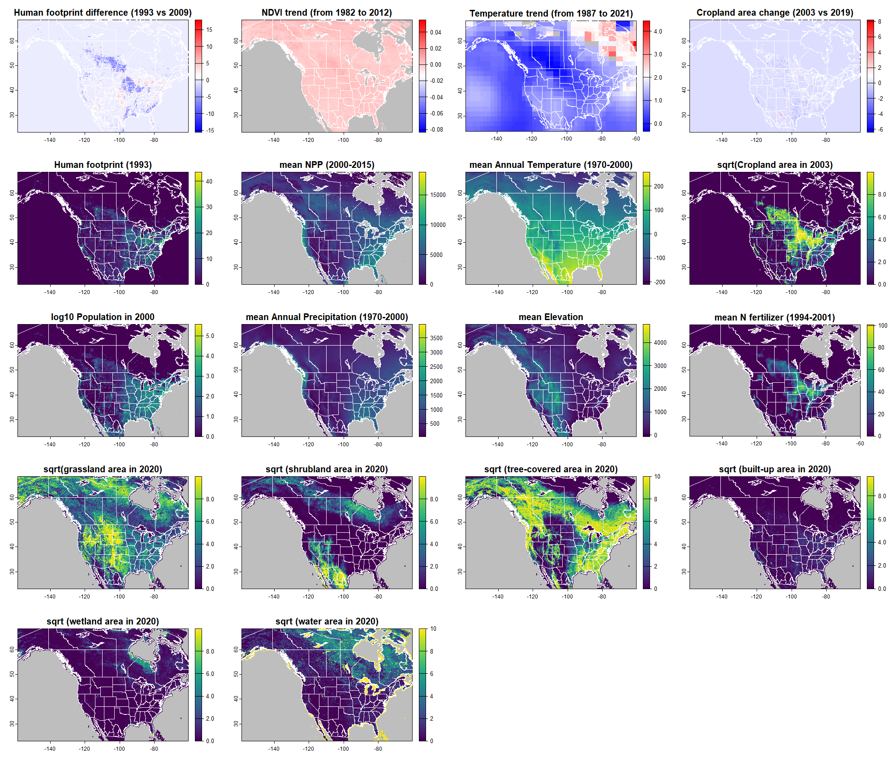
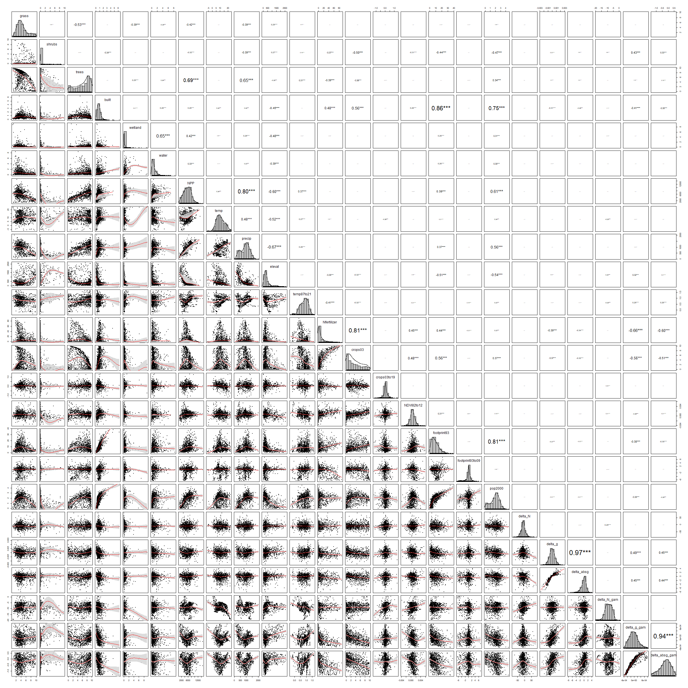

```{r setup, include=FALSE}
knitr::opts_chunk$set(echo = TRUE)
```

# Load libraries and data

```{r, warning = FALSE, message = FALSE}
library(sf)
library(terra)
library(mgcv) 
library(geodata) 
library(rnaturalearth)
library(tidyverse)
library(randomForest)
library(psych)
library(forcats)
library(caret)
library(caretEnsemble)
library(pdp)
rm(list = ls()) # clear the environment
```

```{r, warning = FALSE, message = FALSE}
# Load the shapefile with BBS routes
routes <- st_read("../data/routes_shp/routes_selected_lines.shp") %>% arrange(routes)

## get the states polygon
states <-
  ne_states(returnclass = "sf") %>%
  filter(adm0_a3 == "CAN" | adm0_a3 == "USA" | adm0_a3 == "MEX") %>%
  filter(woe_name != "Hawaii") %>%
  st_crop(st_bbox(c(xmin = -165,
                    xmax = -60,
                    ymax = 62,
                    ymin = 16)))

```

# Loading rasters and extracting their values to the routes

## Area of land cover types

```{r}
grass <- sqrt(terra::rast("rasters/grassland.tif"))
routes$grass <- terra::extract(grass, routes, fun = mean)[,2]

shrubs <- sqrt(terra::rast("rasters/shrubs.tif"))
routes$shrubs <- terra::extract(shrubs, routes, fun = mean)[,2]

trees <- sqrt(terra::rast("rasters/trees.tif"))
routes$trees <- terra::extract(trees, routes, fun = mean)[,2]

built <- sqrt(terra::rast("rasters/built.tif"))
routes$built <- terra::extract(built, routes, fun = mean)[,2]

wetland <- sqrt(terra::rast("rasters/wetland.tif"))
routes$wetland <- terra::extract(wetland, routes, fun = mean)[,2]

water <- sqrt(terra::rast("rasters/water.tif"))
routes$water <- terra::extract(water, routes, fun = mean)[,2]
```

## Net primary productivity (NPP) from MODIS

```{r}
NPP <- terra::rast("rasters/NPP.tif")
routes$NPP <- terra::extract(NPP, routes, fun = mean)[,2]
```

## Temperature, precipitation, and elevation from WorldClim

```{r}
temp <- terra::rast("rasters/temp.tif")
routes$temp <- terra::extract(temp, routes, fun = mean)[,2]/10

precip <- terra::rast("rasters/precip.tif")
routes$precip <- terra::extract(precip, routes, fun = mean)[,2]

elevat <- terra::rast("rasters/elev.tif")
routes$elevat <- terra::extract(elevat, routes, fun = mean)[,2]
```

## Temperature trend (1987-2021)

```{r}
temp87to21 <- terra::rast("rasters/temp87to21.tif")
routes$temp87to21 <- terra::extract(temp87to21, routes, fun = mean)[,2]
```

## Nitrogen fertilizer usage 

```{r}
Nfertilizer <- terra::rast("rasters/Nfertilizer.tif")
routes$Nfertilizer <- terra::extract(Nfertilizer, routes, fun = mean)[,2]
```

## Cropland area and its temporal change (2003-2019)

```{r}
crops03 <- sqrt(terra::rast("rasters/crops03.tif"))
crops19 <- sqrt(terra::rast("rasters/crops19.tif"))

routes$crops03 <- terra::extract(crops03, routes, fun = mean)[,2]
routes$crops19 <- terra::extract(crops19, routes, fun = mean)[,2]
routes$crops03to19 <- routes$crops19 - routes$crops03
```

## Normalized Difference Vegetation Index (NDVI) change (1982-2012)

```{r}
NDVI82to12 <- terra::rast("rasters/NDVI82to12.tif")
routes$NDVI82to12 <- terra::extract(NDVI82to12, routes, fun = mean)[,2]
```

## Human footprint and its temporal change (1993-2009)

```{r}
footprint93 <- terra::rast("rasters/footprint93.tif")
footprint09 <- terra::rast("rasters/footprint09.tif")
delta.footprint <- footprint09 - footprint93

# extract the values from the rasters to routes
routes$footprint93 <- terra::extract(footprint93, routes, fun = mean)[,2]
routes$footprint09 <- terra::extract(footprint09, routes, fun = mean)[,2]
routes$footprint93to09 <- terra::extract(delta.footprint, routes, fun = mean)[,2]
```

## Human population density in 2000

```{r}
# load the 2.5 min raster with human population density
pop2000 <- log10(rast("rasters/pop2000.tif") + 1)

# extract the population density values, summing the values of 2.5 min pixels touching a route
routes$pop2000 <- terra::extract(pop2000, routes, fun = mean)[,2]
```

# Plot the rasters

```{r}
png("rasters.png", width= 2000, height = 1700, res = 150)

par(mfrow=c(5,4))

plot(footprint09 - footprint93, col=map.pal("differences", 100),
     main = "Human footprint difference (1993 vs 2009)",
     background = "grey")
lines(states, col = "white")

plot(NDVI82to12, col=map.pal("differences", 100),
     main = "NDVI trend (from 1982 to 2012)",
     background = "grey")
lines(states, col = "white")

plot(temp87to21, col=map.pal("differences", 100),
     main = "Temperature trend (from 1987 to 2021)",
     background = "grey")
lines(states, col = "white")

plot(crops19 - crops03, col=map.pal("differences", 100),
     main = "Cropland area change (2003 vs 2019)",
     background = "grey")
lines(states, col = "white")

# ---------

plot(footprint93, col=map.pal("viridis", 100),
     main = "Human footprint (1993)",
     background = "grey")
lines(states, col = "white")

plot(NPP, col=map.pal("viridis", 100),
     main = "mean NPP (2000-2015)",
     background = "grey")
lines(states, col = "white")

plot(temp, col=map.pal("viridis", 100),
     main = "mean Annual Temperature (1970-2000)",
     background = "grey")
lines(states, col = "white")

plot(crops03, col=map.pal("viridis", 100),
     main = "sqrt(Cropland area in 2003)",
     background = "grey")
lines(states, col = "white")

# -----------

plot(pop2000, col=map.pal("viridis", 100),
     main = "log10 Population in 2000",
     background = "grey")
lines(states, col = "white")

plot(precip, col=map.pal("viridis", 100),
     main = "mean Annual Precipitation (1970-2000)",
     background = "grey")
lines(states, col = "white")

plot(elevat, col=map.pal("viridis", 100),
     main = "mean Elevation",
     background = "grey")
lines(states, col = "white")

plot(Nfertilizer, col=map.pal("viridis", 100),
     main = "mean N fertilizer (1994-2001)",
     background = "grey")
lines(states, col = "white")

# -----------

plot(grass, col=map.pal("viridis", 100),
     main = "sqrt(grassland area in 2020)",
     background = "grey")
lines(states, col = "white")

plot(shrubs, col=map.pal("viridis", 100),
     main = "sqrt (shrubland area in 2020)",
     background = "grey")
lines(states, col = "white")

plot(trees, col=map.pal("viridis", 100),
     main = "sqrt (tree-covered area in 2020)",
     background = "grey")
lines(states, col = "white")

plot(built, col=map.pal("viridis", 100),
     main = "sqrt (built-up area in 2020)",
     background = "grey")
lines(states, col = "white")

plot(wetland, col=map.pal("viridis", 100),
     main = "sqrt (wetland area in 2020)",
     background = "grey")
lines(states, col = "white")

plot(water, col=map.pal("viridis", 100),
     main = "sqrt (water area in 2020)",
     background = "grey")
lines(states, col = "white")

dev.off()
```



# Load the estimated demographic rates

```{r}
# Load the models' output
for(file in list.files("../mixed_model/outputs/", full.names = T)){
  assign(gsub("^../mixed_model/outputs/|\\.rds$","",file),
         readRDS(file = file))
}

# THE GAM MODEL 
# extract latitude and longitude of route centroids
coords <- data.frame(st_centroid(routes) %>% st_coordinates() )
names(coords) <- c("lon","lat")
routes <- cbind(routes, coords)

## Add raw (not smoothed) values the dataset
routes$delta_N <- as.numeric(overall_N_output$mean$beta1)
routes$delta_g <- as.numeric(overall_g_output$mean$beta1)
routes$delta_absg <- as.numeric(overall_absg_output$mean$beta1)

# fit the gam models
routes$delta_N_gam <- gam(delta_N ~ s(lon, lat, bs = "gp", k = 100, m = 2),
                          data = routes)$fitted.values
routes$delta_g_gam <- gam(delta_g ~ s(lon, lat, bs = "gp", k = 100, m = 2),
                          data = routes)$fitted.values
routes$delta_absg_gam <- gam(delta_absg ~ s(lon, lat, bs = "gp", k = 100, m = 2),
                          data = routes)$fitted.values

# prepare data.frame for analyses
data.frame(names(routes))
dat <- as.data.frame(routes[, 24:ncol(routes)])

# remove variables that we don't want in the pairplot
dat <- select(dat, -c("geometry")) # remove the last "geometry" column
dat <- select(dat, -c("crops19", "footprint09")) 
dat <- select(dat, -c("lat", "lon")) # remove spatial coordinates 
```

# Pairwise Spearman correlations

```{r}
png("all_pairs.png", width= 2500, height = 2500)

psych::pairs.panels(dat,
                    ellipses = FALSE,
                    density = TRUE,
                    smooth = TRUE,
                    ci = TRUE,
                    stars = TRUE,
                    scale = TRUE,
                    hist.col = "grey",
                    method = "spearman") # note the Spearman coefficient!

dev.off()
```



# Tree-based analysis 

## Smoothed values

Set predictors

```{r}
# set all the predictors here which will be used in all the rf models
rf.predictors <- c("grass",
                   "trees",
                   "shrubs",
                   "water",
                   "temp",
                   "Nfertilizer",
                   # "crops03",
                   "footprint93",
                   "NDVI82to12",
                   "temp87to21",
                   "footprint93to09",
                   "crops03to19")
```

### Absolute growth rate change (delta absg)

```{r, message=FALSE, results='hide'}
# First we split the dataset into training and validation datasets
set.seed(333)
traindata <- trainControl(method = "repeatedcv", number = 10, repeats = 3)
## We use three tree-based algorithms in order to assess which one perform the best
## Create the list of models
model_list_deltaabsg <-
  caretList(
    delta_absg_gam ~ ., 
    data = na.omit(dat[,c(rf.predictors,"delta_absg_gam")]),
    trControl = traindata,
    metric = "RMSE",
    tuneList = list(
      rf =  caretModelSpec(method = "ranger", 
                           importance = "permutation",
                           tuneGrid = data.frame(mtry = ceiling((ncol(dat[,rf.predictors])-1)/3),
                                                                    splitrule = "variance",
                                                                    min.node.size = 5)),
      gbm = caretModelSpec(method = "gbm",
                           distribution = "gaussian",
                           # keep.data = TRUE,
                           tuneGrid = data.frame(n.trees = 500,
                                                 interaction.depth = 1,
                                                 shrinkage = 0.1,
                                                 n.minobsinnode = 5)),
      xgboost = caretModelSpec(method = "xgbTree",
                               tuneGrid = expand.grid(nrounds = 500,
                                                     max_depth = 5,
                                                     eta = 0.1,
                                                     gamma = 0,
                                                     colsample_bytree = 1,
                                                     min_child_weight = 1,
                                                     subsample = 1))
    )
  )

# saveRDS(model_list_deltaabsg, "models/model_list_deltaabsg.rds")
```

### Growth rate change (delta g)

```{r, message=FALSE, results='hide'}
## Create the list of models
model_list_deltag <-
  caretList(
    delta_g_gam ~ ., 
    data = na.omit(dat[,c(rf.predictors,"delta_g_gam")]),
    trControl = traindata,
    metric = "RMSE",
    tuneList = list(
      rf =  caretModelSpec(method = "ranger", 
                           importance = "permutation",
                           tuneGrid = data.frame(mtry = ceiling((ncol(dat[,rf.predictors])-1)/3),
                                                                    splitrule = "variance",
                                                                    min.node.size = 5)),
      gbm = caretModelSpec(method = "gbm",
                           distribution = "gaussian",
                           # keep.data = TRUE,
                           tuneGrid = data.frame(n.trees = 500,
                                                 interaction.depth = 1,
                                                 shrinkage = 0.1,
                                                 n.minobsinnode = 5)),
      xgboost = caretModelSpec(method = "xgbTree",
                               tuneGrid = expand.grid(nrounds = 500,
                                                     max_depth = 5,
                                                     eta = 0.1,
                                                     gamma = 0,
                                                     colsample_bytree = 1,
                                                     min_child_weight = 1,
                                                     subsample = 1))
    )
  )

# saveRDS(model_list_deltag, "models/model_list_deltag.rds")
```

### Abundance change (delta N)

```{r, message=FALSE, results='hide'}
## Create the list of models
model_list_deltaN <-
  caretList(
    delta_N_gam ~ ., 
    data = na.omit(dat[,c(rf.predictors,"delta_N_gam")]),
    trControl = traindata,
    metric = "RMSE",
    tuneList = list(
      rf =  caretModelSpec(method = "ranger", 
                           importance = "permutation",
                           tuneGrid = data.frame(mtry = ceiling((ncol(dat[,rf.predictors])-1)/3),
                                                                    splitrule = "variance",
                                                                    min.node.size = 5)),
      gbm = caretModelSpec(method = "gbm",
                           distribution = "gaussian",
                           # keep.data = TRUE,
                           tuneGrid = data.frame(n.trees = 500,
                                                 interaction.depth = 1,
                                                 shrinkage = 0.1,
                                                 n.minobsinnode = 5)),
      xgboost = caretModelSpec(method = "xgbTree",
                               tuneGrid = expand.grid(nrounds = 500,
                                                     max_depth = 5,
                                                     eta = 0.1,
                                                     gamma = 0,
                                                     colsample_bytree = 1,
                                                     min_child_weight = 1,
                                                     subsample = 1))
    )
  )

# saveRDS(model_list_deltaN, "models/model_list_deltaN.rds")
```

### Assess the best models

```{r}
## For delta N
resamples_deltaN <- resamples(model_list_deltaN)
summary(resamples_deltaN)
```

The best model is the XGBoost.

```{r}
## For delta g
resamples_deltag <- resamples(model_list_deltag)
summary(resamples_deltag)
```

The best model is the Random Forest.

```{r}
## For delta absolute g
resamples_deltaabsg <- resamples(model_list_deltaabsg)
summary(resamples_deltaabsg)
```

The best model is the XGBoost.

### Plot variable importances

```{r}
covariate_colors <- c(
  "Mean Temperature\n(1970-2000)" = "#CC6677",
  "Temperature change\n(1987-2021)" = "#332288",
  "Tree cover\n(2020)" =  "#DDCC77",
  "Shrub cover\n(2020)" = "#117733",
  "Nitrogen fertilizer use\n(1994-2001)" = "#88CCEE",
  # "Cropland area\n(2003)" = "#88CCEE",
  "Human foortprint change\n(1993-2009)" = "#882255",
  "Grassland cover\n(2020)" = "#44AA99",
  "Human footprint\n(1993)" = "#999933",
  "Crops cover change\n(2003-2019)" = "#AA4499",
  "NDVI change\n(1982-2012)" = "#DDDDDD",
  "Water cover\n(2020)" = "#000000"
)

pdf("importance_deltaN.pdf", width = 5.83, height = 4.13)

varImp(model_list_deltaN$xgboost)$importance %>%  
  mutate(response = "deltaN") %>% 
  rownames_to_column() %>% 
  rename(variable = "rowname",
         importance = "Overall") %>% 
  mutate(variable = case_when(
    variable == "temp" ~ "Mean Temperature\n(1970-2000)",
    variable == "temp87to21" ~ "Temperature change\n(1987-2021)",
    variable == "trees" ~ "Tree cover\n(2020)",
    variable == "shrubs" ~ "Shrub cover\n(2020)",
    variable == "Nfertilizer" ~ "Nitrogen fertilizer use\n(1994-2001)",
    # variable == "crops03" ~ "Cropland area\n(2003)",
    variable == "footprint93to09" ~ "Human foortprint change\n(1993-2009)",
    variable == "grass" ~ "Grassland cover\n(2020)",
    variable == "footprint93" ~ "Human footprint\n(1993)",
    variable == "crops03to19" ~ "Crops cover change\n(2003-2019)",
    variable == "NDVI82to12" ~ "NDVI change\n(1982-2012)",
    variable == "water" ~ "Water cover\n(2020)")) %>% 
  mutate(variable = reorder(variable, importance)) %>% 
  ggplot(aes(x = importance, y = variable, fill = variable)) +
  geom_col() +
  xlab("Relative importance")+
  scale_fill_manual(values = covariate_colors, guide = "none")+
  theme_bw()

dev.off()

pdf("importance_deltag.pdf", width = 5.83, height = 4.13)

varImp(model_list_deltag$rf)$importance %>%  
  mutate(response = "deltag") %>% 
  rownames_to_column() %>% 
  rename(variable = "rowname",
         importance = "Overall") %>% 
  mutate(variable = case_when(
    variable == "temp" ~ "Mean Temperature\n(1970-2000)",
    variable == "temp87to21" ~ "Temperature change\n(1987-2021)",
    variable == "trees" ~ "Tree cover\n(2020)",
    variable == "shrubs" ~ "Shrub cover\n(2020)",
    variable == "Nfertilizer" ~ "Nitrogen fertilizer use\n(1994-2001)",
    # variable == "crops03" ~ "Cropland area\n(2003)",
    variable == "footprint93to09" ~ "Human foortprint change\n(1993-2009)",
    variable == "grass" ~ "Grassland cover\n(2020)",
    variable == "footprint93" ~ "Human footprint\n(1993)",
    variable == "crops03to19" ~ "Crops cover change\n(2003-2019)",
    variable == "NDVI82to12" ~ "NDVI change\n(1982-2012)",
    variable == "water" ~ "Water cover\n(2020)")) %>% 
  mutate(variable = reorder(variable, importance)) %>% 
  ggplot(aes(x = importance, y = variable, fill = variable)) +
  geom_col() +
  xlab("Relative importance")+
  scale_fill_manual(values = covariate_colors, guide = "none")+
  theme_bw()

dev.off()

pdf("importance_deltaabsg.pdf", width = 5.83, height = 4.13)

varImp(model_list_deltaabsg$xgboost)$importance %>%  
  mutate(response = "deltaabsg") %>% 
  rownames_to_column() %>% 
  rename(variable = "rowname",
         importance = "Overall") %>% 
  mutate(variable = case_when(
    variable == "temp" ~ "Mean Temperature\n(1970-2000)",
    variable == "temp87to21" ~ "Temperature change\n(1987-2021)",
    variable == "trees" ~ "Tree cover\n(2020)",
    variable == "shrubs" ~ "Shrub cover\n(2020)",
    variable == "Nfertilizer" ~ "Nitrogen fertilizer use\n(1994-2001)",
    # variable == "crops03" ~ "Cropland area\n(2003)",
    variable == "footprint93to09" ~ "Human foortprint change\n(1993-2009)",
    variable == "grass" ~ "Grassland cover\n(2020)",
    variable == "footprint93" ~ "Human footprint\n(1993)",
    variable == "crops03to19" ~ "Crops cover change\n(2003-2019)",
    variable == "NDVI82to12" ~ "NDVI change\n(1982-2012)",
    variable == "water" ~ "Water cover\n(2020)")) %>% 
  mutate(variable = reorder(variable, importance)) %>% 
  ggplot(aes(x = importance, y = variable, fill = variable)) +
  geom_col() +
  xlab("Relative importance")+
  scale_fill_manual(values = covariate_colors, guide = "none")+
  theme_bw()

dev.off()

pdf("importance.pdf", width = 8, height = 4.13)

varImp(model_list_deltaN$xgboost)$importance %>%  
  mutate(response = "deltaN") %>% 
  rownames_to_column() %>% 
  rbind(
    varImp(model_list_deltaabsg$xgboost)$importance %>%  
    mutate(response = "deltaabsg") %>% 
    rownames_to_column()
  ) %>% 
  rbind(
    varImp(model_list_deltag$rf)$importance %>%  
    mutate(response = "deltag") %>% 
    rownames_to_column()
  ) %>% 
  rename(variable = "rowname",
         importance = "Overall") %>% 
  mutate(variable = case_when(
    variable == "temp" ~ "Mean Temperature\n(1970-2000)",
    variable == "temp87to21" ~ "Temperature change\n(1987-2021)",
    variable == "trees" ~ "Tree cover\n(2020)",
    variable == "shrubs" ~ "Shrub cover\n(2020)",
    variable == "Nfertilizer" ~ "Nitrogen fertilizer use\n(1994-2001)",
    # variable == "crops03" ~ "Cropland area\n(2003)",
    variable == "footprint93to09" ~ "Human foortprint change\n(1993-2009)",
    variable == "grass" ~ "Grassland cover\n(2020)",
    variable == "footprint93" ~ "Human footprint\n(1993)",
    variable == "crops03to19" ~ "Crops cover change\n(2003-2019)",
    variable == "NDVI82to12" ~ "NDVI change\n(1982-2012)",
    variable == "water" ~ "Water cover\n(2020)")) %>% 
  mutate(variable = reorder(variable, importance),
         response = factor(response, levels = c("deltaN", "deltaabsg", "deltag"))) %>% 
  ggplot(aes(x = importance, y = variable, fill = variable)) +
  facet_wrap(vars(response))+
  geom_col() +
  xlab("Relative importance")+
  scale_fill_manual(values = covariate_colors, guide = "none")+
  theme_bw()+
  theme(strip.background = element_blank(), strip.text = element_blank())
  
dev.off()


```

```{r, echo=FALSE}
varimp <-
  varImp(model_list_deltaN$xgboost)$importance %>%  
  mutate(response = "deltaN") %>% 
  rownames_to_column() %>% 
  rbind(
    varImp(model_list_deltaabsg$xgboost)$importance %>%  
    mutate(response = "deltaabsg") %>% 
    rownames_to_column()
  ) %>% 
  rbind(
    varImp(model_list_deltag$rf)$importance %>%  
    mutate(response = "deltag") %>% 
    rownames_to_column()
  ) %>% 
  rename(variable = "rowname",
         importance = "Overall") %>% 
  mutate(variable = case_when(
    variable == "temp" ~ "Mean Temperature\n(1970-2000)",
    variable == "temp87to21" ~ "Temperature change\n(1987-2021)",
    variable == "trees" ~ "Tree cover\n(2020)",
    variable == "shrubs" ~ "Shrub cover\n(2020)",
    variable == "Nfertilizer" ~ "Nitrogen fertilizer use\n(1994-2001)",
    # variable == "crops03" ~ "Cropland area\n(2003)",
    variable == "footprint93to09" ~ "Human foortprint change\n(1993-2009)",
    variable == "grass" ~ "Grassland cover\n(2020)",
    variable == "footprint93" ~ "Human footprint\n(1993)",
    variable == "crops03to19" ~ "Crops cover change\n(2003-2019)",
    variable == "NDVI82to12" ~ "NDVI change\n(1982-2012)",
    variable == "water" ~ "Water cover\n(2020)")) %>% 
  mutate(variable = reorder(variable, importance),
         response = factor(response, levels = c("deltaN", "deltaabsg", "deltag"))) %>% 
  ggplot(aes(x = importance, y = variable, fill = variable)) +
  facet_wrap(vars(response))+
  geom_col() +
  xlab("Relative importance")+
  scale_fill_manual(values = covariate_colors, guide = "none")+
  theme_bw()+
  theme(strip.background = element_blank(), strip.text = element_blank())
```


### Partial dependence plots

```{r}
library(pdp)
```

```{r}
importance_order_deltag <- varImp(model_list_deltag$rf)$importance %>%
  rownames_to_column("variable") %>%
  mutate(variable = case_when(
    variable == "temp" ~ "Mean Temperature\n(1970-2000)",
    variable == "temp87to21" ~ "Temperature change\n(1987-2021)",
    variable == "trees" ~ "Tree cover\n(2020)",
    variable == "shrubs" ~ "Shrub cover\n(2020)",
    variable == "Nfertilizer" ~ "Nitrogen fertilizer use\n(1994-2001)",
    # variable == "crops03" ~ "Cropland area\n(2003)",
    variable == "footprint93to09" ~ "Human foortprint change\n(1993-2009)",
    variable == "grass" ~ "Grassland cover\n(2020)",
    variable == "footprint93" ~ "Human footprint\n(1993)",
    variable == "crops03to19" ~ "Crops cover change\n(2003-2019)",
    variable == "NDVI82to12" ~ "NDVI change\n(1982-2012)",
    variable == "water" ~ "Water cover\n(2020)")) %>% 
  arrange(desc(Overall)) %>%
  pull(variable)

importance_order_deltaN <- varImp(model_list_deltaN$xgboost)$importance %>%
  rownames_to_column("variable") %>%
  mutate(variable = case_when(
    variable == "temp" ~ "Mean Temperature\n(1970-2000)",
    variable == "temp87to21" ~ "Temperature change\n(1987-2021)",
    variable == "trees" ~ "Tree cover\n(2020)",
    variable == "shrubs" ~ "Shrub cover\n(2020)",
    variable == "Nfertilizer" ~ "Nitrogen fertilizer use\n(1994-2001)",
    # variable == "crops03" ~ "Cropland area\n(2003)",
    variable == "footprint93to09" ~ "Human foortprint change\n(1993-2009)",
    variable == "grass" ~ "Grassland cover\n(2020)",
    variable == "footprint93" ~ "Human footprint\n(1993)",
    variable == "crops03to19" ~ "Crops cover change\n(2003-2019)",
    variable == "NDVI82to12" ~ "NDVI change\n(1982-2012)",
    variable == "water" ~ "Water cover\n(2020)")) %>% 
  arrange(desc(Overall)) %>%
  pull(variable)

importance_order_deltaabsg <- varImp(model_list_deltaabsg$xgboost)$importance %>%
  rownames_to_column("variable") %>%
  mutate(variable = case_when(
    variable == "temp" ~ "Mean Temperature\n(1970-2000)",
    variable == "temp87to21" ~ "Temperature change\n(1987-2021)",
    variable == "trees" ~ "Tree cover\n(2020)",
    variable == "shrubs" ~ "Shrub cover\n(2020)",
    variable == "Nfertilizer" ~ "Nitrogen fertilizer use\n(1994-2001)",
    # variable == "crops03" ~ "Cropland area\n(2003)",
    variable == "footprint93to09" ~ "Human foortprint change\n(1993-2009)",
    variable == "grass" ~ "Grassland cover\n(2020)",
    variable == "footprint93" ~ "Human footprint\n(1993)",
    variable == "crops03to19" ~ "Crops cover change\n(2003-2019)",
    variable == "NDVI82to12" ~ "NDVI change\n(1982-2012)",
    variable == "water" ~ "Water cover\n(2020)")) %>% 
  arrange(desc(Overall)) %>%
  pull(variable)
```


#### Growth rate change (delta g)

```{r}
covariate_labels <- c(
  "temp" = "Mean Temperature\n(1970-2000)",
  "temp87to21" = "Temperature change\n(1987-2021)",
  "trees" = "Tree cover\n(2020)",
  "shrubs" = "Shrub cover\n(2020)",
  "Nfertilizer" = "Nitrogen fertilizer use\n(1994-2001)",
  # "crops03" = "Cropland area\n(2003)",
  "footprint93to09" = "Human foortprint change\n(1993-2009)",
  "grass" = "Grassland cover\n(2020)",
  "footprint93" = "Human footprint\n(1993)",
  "crops03to19" = "Crops cover change\n(2003-2019)",
  "NDVI82to12" = "NDVI change\n(1982-2012)",
  "water" = "Water cover\n(2020)"
)

pp <- data.frame(x = as.numeric(), y = as.numeric(), covariate = as.character())
for(cov in model_list_deltaN$xgboost$coefnames){
  
  pp <- rbind(pp, 
              partial(model_list_deltag$rf, cov,
                      train = dat[,c(rf.predictors,"delta_g_gam")]) %>%
                mutate(covariate = cov) %>% rename(x = cov))
  
}

# Rename covariate column
pp$covariate <- covariate_labels[pp$covariate]
# Reorder
pp$covariate <- factor(pp$covariate, levels = importance_order_deltag)


pdf("pdp_g.pdf", width = 8.27, height = 5.83)

ggplot(pp)+
  geom_line(aes(x, yhat, color = covariate), size = 1)+
  facet_wrap(vars(covariate), scales = "free_x")+
  ylab("Growth rate change (delta g)")+
  theme_bw()+
  theme(
    axis.title = element_blank(),
    strip.text = element_text(size = 7.3),
    axis.text = element_text(size = 6),
    strip.background = element_blank(),
    panel.grid.minor = element_blank(),
    panel.border = element_blank()
  )+
  scale_color_manual(values = covariate_colors, guide = "none")+
  annotate("segment", x=-Inf, xend=Inf, y=-Inf, yend=-Inf, size = .7)+
  annotate("segment", x=-Inf, xend=-Inf, y=-Inf, yend=Inf, size = .7)

dev.off()
```

```{r, echo=FALSE}
ggplot(pp)+
  geom_line(aes(x, yhat, color = covariate), size = 1)+
  facet_wrap(vars(covariate), scales = "free_x")+
  ylab("Growth rate change (delta g)")+
  theme_bw()+
  theme(
    axis.title = element_blank(),
    strip.text = element_text(size = 7.3),
    axis.text = element_text(size = 6),
    strip.background = element_blank(),
    # panel.grid.major = element_blank(),
    panel.grid.minor = element_blank(),
    panel.border = element_blank()
  )+
  scale_color_manual(values = covariate_colors, guide = "none")+
  annotate("segment", x=-Inf, xend=Inf, y=-Inf, yend=-Inf, size = .7)+
  annotate("segment", x=-Inf, xend=-Inf, y=-Inf, yend=Inf, size = .7)

pp_g <-
  ggplot(pp)+
  geom_line(aes(x, yhat, color = covariate), size = 1)+
  facet_wrap(vars(covariate), scales = "free_x")+
  ylab("Growth rate change (delta g)")+
  geom_hline(yintercept = 0, linetype = "dashed")+
  theme_bw()+
  theme(
    axis.title = element_blank(),
    strip.text = element_text(size = 7.3),
    axis.text = element_text(size = 6),
    strip.background = element_blank(),
    panel.grid.minor = element_blank(),
    panel.border = element_blank()
  )+
  scale_color_manual(values = covariate_colors, guide = "none")+
  annotate("segment", x=-Inf, xend=Inf, y=-Inf, yend=-Inf, size = .7)+
  annotate("segment", x=-Inf, xend=-Inf, y=-Inf, yend=Inf, size = .7)

```


#### Abundance change (delta N)

```{r}
pp <- data.frame(x = as.numeric(), y = as.numeric(), covariate = as.character())
for(cov in model_list_deltaN$xgboost$coefnames){
  
  pp <- rbind(pp, 
              partial(model_list_deltaN$xgboost, cov,
                      train = dat[,c(rf.predictors,"delta_N_gam")]) %>%
                mutate(covariate = cov) %>% rename(x = cov))
  
}

# Rename covariate column
pp$covariate <- covariate_labels[pp$covariate]
# Reorder
pp$covariate <- factor(pp$covariate, levels = importance_order_deltaN)

pdf("pdp_N.pdf", width = 8.27, height = 5.83)

ggplot(pp)+
  geom_line(aes(x, yhat, colour = covariate), size = 1)+
  facet_wrap(vars(covariate), scales = "free_x")+
  ylab("Abundance change (delta N)")+
  theme_bw()+
  theme(
    axis.title = element_blank(),
    strip.text = element_text(size = 7.3),
    axis.text = element_text(size = 6),
    strip.background = element_blank(),
    panel.grid.minor = element_blank(),
    panel.border = element_blank()
  )+
  scale_color_manual(values = covariate_colors, guide = "none")+
  annotate("segment", x=-Inf, xend=Inf, y=-Inf, yend=-Inf, size = .7)+
  annotate("segment", x=-Inf, xend=-Inf, y=-Inf, yend=Inf, size = .7)

dev.off()
```

```{r, echo=FALSE}
ggplot(pp)+
  geom_line(aes(x, yhat, colour = covariate), size = 1)+
  facet_wrap(vars(covariate), scales = "free_x")+
  ylab("Abundance change (delta N)")+
  theme_bw()+
  theme(
    axis.title = element_blank(),
    strip.text = element_text(size = 7.3),
    axis.text = element_text(size = 6),
    strip.background = element_blank(),
    panel.grid.minor = element_blank(),
    panel.border = element_blank()
  )+
  scale_color_manual(values = covariate_colors, guide = "none")+
  annotate("segment", x=-Inf, xend=Inf, y=-Inf, yend=-Inf, size = .7)+
  annotate("segment", x=-Inf, xend=-Inf, y=-Inf, yend=Inf, size = .7)

pp_N <-
  ggplot(pp)+
  geom_line(aes(x, yhat, color = covariate), size = 1)+
  facet_wrap(vars(covariate), scales = "free_x")+
  ylab("Growth rate change (delta g)")+
  theme_bw()+
  theme(
    axis.title = element_blank(),
    strip.text = element_text(size = 7.3),
    axis.text = element_text(size = 6),
    strip.background = element_blank(),
    panel.grid.minor = element_blank(),
    panel.border = element_blank()
  )+
  scale_color_manual(values = covariate_colors, guide = "none")+
  annotate("segment", x=-Inf, xend=Inf, y=-Inf, yend=-Inf, size = .7)+
  annotate("segment", x=-Inf, xend=-Inf, y=-Inf, yend=Inf, size = .7)
```

#### Absolute growth rate change (delta absg)

```{r}
pp <- data.frame(x = as.numeric(), y = as.numeric(), covariate = as.character())
for(cov in model_list_deltaabsg$xgboost$coefnames){
  
  pp <- rbind(pp, 
              partial(model_list_deltaabsg$xgboost, cov,
                      train = dat[,c(rf.predictors,"delta_absg_gam")]) %>%
                mutate(covariate = cov) %>% rename(x = cov))
  
}

# Rename covariate column
pp$covariate <- covariate_labels[pp$covariate]
# Reorder
pp$covariate <- factor(pp$covariate, levels = importance_order_deltaabsg)

pdf("pdp_absg.pdf", width = 8.27, height = 5.83)

ggplot(pp)+
  geom_line(aes(x, yhat, colour = covariate), size = 1)+
  facet_wrap(vars(covariate), scales = "free_x")+
  ylab("Abundance change (delta N)")+
  geom_hline(yintercept = 0, linetype = "dashed")+
  theme_bw()+
  theme(
    axis.title = element_blank(),
    strip.text = element_text(size = 7.3),
    axis.text = element_text(size = 6),
    strip.background = element_blank(),
    panel.grid.minor = element_blank(),
    panel.border = element_blank()
  )+
  scale_color_manual(values = covariate_colors, guide = "none")+
  annotate("segment", x=-Inf, xend=Inf, y=-Inf, yend=-Inf, size = .7)+
  annotate("segment", x=-Inf, xend=-Inf, y=-Inf, yend=Inf, size = .7)

dev.off()
```

```{r, echo=FALSE}
ggplot(pp)+
  geom_line(aes(x, yhat, colour = covariate), size = 1)+
  facet_wrap(vars(covariate), scales = "free_x")+
  ylab("Abundance change (delta N)")+
  geom_hline(yintercept = 0, linetype = "dashed")+
  theme_bw()+
  theme(
    axis.title = element_blank(),
    strip.text = element_text(size = 7.3),
    axis.text = element_text(size = 6),
    strip.background = element_blank(),
    panel.grid.minor = element_blank(),
    panel.border = element_blank()
  )+
  scale_color_manual(values = covariate_colors, guide = "none")+
  annotate("segment", x=-Inf, xend=Inf, y=-Inf, yend=-Inf, size = .7)+
  annotate("segment", x=-Inf, xend=-Inf, y=-Inf, yend=Inf, size = .7)


pp_absg <-
  ggplot(pp)+
  geom_line(aes(x, yhat, colour = covariate), size = 1)+
  facet_wrap(vars(covariate), scales = "free_x")+
  ylab("Absolute growth rate change (delta absg)")+
  geom_hline(yintercept = 0, linetype = "dashed")+
  theme_bw()+
  theme(
    axis.title = element_blank(),
    strip.text = element_text(size = 7.3),
    axis.text = element_text(size = 6),
    strip.background = element_blank(),
    panel.grid.minor = element_blank(),
    panel.border = element_blank()
  )+
  scale_color_manual(values = covariate_colors, guide = "none")+
  annotate("segment", x=-Inf, xend=Inf, y=-Inf, yend=-Inf, size = .7)+
  annotate("segment", x=-Inf, xend=-Inf, y=-Inf, yend=Inf, size = .7)
```


```{r, echo = F}
pdf("fig2.pdf", width = 11.69, height = 8.27)
final_plot <- varimp / (pp_N | pp_absg | pp_g)
final_plot + patchwork::plot_layout(heights = c(0.4, 0.6))
dev.off()
```

## Raw values

### Absolute growth rate change (delta absg)

```{r, message=FALSE, results='hide'}
# First we split the dataset into training and validation datasets
set.seed(333)
traindata <- trainControl(method = "repeatedcv", number = 10, repeats = 3)
## We use three tree-based algorithms in order to assess which one perform the best
## Create the list of models
model_list_deltaabsg_raw <-
  caretList(
    delta_absg ~ ., 
    data = na.omit(dat[,c(rf.predictors,"delta_absg")]),
    trControl = traindata,
    metric = "RMSE",
    tuneList = list(
      rf =  caretModelSpec(method = "ranger", 
                           importance = "permutation",
                           tuneGrid = data.frame(mtry = ceiling((ncol(dat[,rf.predictors])-1)/3),
                                                                    splitrule = "variance",
                                                                    min.node.size = 5)),
      gbm = caretModelSpec(method = "gbm",
                           distribution = "gaussian",
                           # keep.data = TRUE,
                           tuneGrid = data.frame(n.trees = 500,
                                                 interaction.depth = 1,
                                                 shrinkage = 0.1,
                                                 n.minobsinnode = 5)),
      xgboost = caretModelSpec(method = "xgbTree",
                               tuneGrid = expand.grid(nrounds = 500,
                                                     max_depth = 5,
                                                     eta = 0.1,
                                                     gamma = 0,
                                                     colsample_bytree = 1,
                                                     min_child_weight = 1,
                                                     subsample = 1))
    )
  )

# saveRDS(model_list_deltaabsg_raw, "models/model_list_deltaabsg_raw.rds")
```

### Growth rate change (delta g)

```{r, message=FALSE, results='hide'}
## Create the list of models
model_list_deltag_raw <-
  caretList(
    delta_g ~ ., 
    data = na.omit(dat[,c(rf.predictors,"delta_g")]),
    trControl = traindata,
    metric = "RMSE",
    tuneList = list(
      rf =  caretModelSpec(method = "ranger", 
                           importance = "permutation",
                           tuneGrid = data.frame(mtry = ceiling((ncol(dat[,rf.predictors])-1)/3),
                                                                    splitrule = "variance",
                                                                    min.node.size = 5)),
      gbm = caretModelSpec(method = "gbm",
                           distribution = "gaussian",
                           # keep.data = TRUE,
                           tuneGrid = data.frame(n.trees = 500,
                                                 interaction.depth = 1,
                                                 shrinkage = 0.1,
                                                 n.minobsinnode = 5)),
      xgboost = caretModelSpec(method = "xgbTree",
                               tuneGrid = expand.grid(nrounds = 500,
                                                     max_depth = 5,
                                                     eta = 0.1,
                                                     gamma = 0,
                                                     colsample_bytree = 1,
                                                     min_child_weight = 1,
                                                     subsample = 1))
    )
  )

# saveRDS(model_list_deltag_raw, "models/model_list_deltag_raw.rds")
```

### Abundance change (delta N)

```{r, message=FALSE, results='hide'}
## Create the list of models
model_list_deltaN_raw <-
  caretList(
    delta_N ~ ., 
    data = na.omit(dat[,c(rf.predictors,"delta_N")]),
    trControl = traindata,
    metric = "RMSE",
    tuneList = list(
      rf =  caretModelSpec(method = "ranger", 
                           importance = "permutation",
                           tuneGrid = data.frame(mtry = ceiling((ncol(dat[,rf.predictors])-1)/3),
                                                                    splitrule = "variance",
                                                                    min.node.size = 5)),
      gbm = caretModelSpec(method = "gbm",
                           distribution = "gaussian",
                           # keep.data = TRUE,
                           tuneGrid = data.frame(n.trees = 500,
                                                 interaction.depth = 1,
                                                 shrinkage = 0.1,
                                                 n.minobsinnode = 5)),
      xgboost = caretModelSpec(method = "xgbTree",
                               tuneGrid = expand.grid(nrounds = 500,
                                                     max_depth = 5,
                                                     eta = 0.1,
                                                     gamma = 0,
                                                     colsample_bytree = 1,
                                                     min_child_weight = 1,
                                                     subsample = 1))
    )
  )

# saveRDS(model_list_deltaN_raw, "models/model_list_deltaN_raw.rds")
```

### Plot Variable importances

```{r}
# Using the same algorithms than for the smoothed values (i.e. XGBoost for delta N, delta abs g and RF for delta g)
pdf("importance_deltaN_raw.pdf", width = 5.83, height = 4.13)

varImp(model_list_deltaN_raw$xgboost)$importance %>%  
  mutate(response = "deltaN") %>% 
  rownames_to_column() %>% 
  rename(variable = "rowname",
         importance = "Overall") %>% 
  mutate(variable = case_when(
    variable == "temp" ~ "Mean Temperature\n(1970-2000)",
    variable == "temp87to21" ~ "Temperature change\n(1987-2021)",
    variable == "trees" ~ "Tree cover\n(2020)",
    variable == "shrubs" ~ "Shrub cover\n(2020)",
    variable == "Nfertilizer" ~ "Nitrogen fertilizer use\n(1994-2001)",
    variable == "footprint93to09" ~ "Human foortprint change\n(1993-2009)",
    variable == "grass" ~ "Grassland cover\n(2020)",
    variable == "footprint93" ~ "Human footprint\n(1993)",
    variable == "crops03to19" ~ "Crops cover change\n(2003-2019)",
    variable == "NDVI82to12" ~ "NDVI change\n(1982-2012)",
    variable == "water" ~ "Water cover\n(2020)")) %>% 
  mutate(variable = reorder(variable, importance)) %>% 
  ggplot(aes(x = importance, y = variable, fill = variable)) +
  geom_col() +
  xlab("Relative importance")+
  scale_fill_manual(values = covariate_colors, guide = "none")+
  theme_bw()

dev.off()

pdf("importance_deltag_raw.pdf", width = 5.83, height = 4.13)

varImp(model_list_deltag_raw$rf)$importance %>%  
  mutate(response = "deltag") %>% 
  rownames_to_column() %>% 
  rename(variable = "rowname",
         importance = "Overall") %>% 
  mutate(variable = case_when(
    variable == "temp" ~ "Mean Temperature\n(1970-2000)",
    variable == "temp87to21" ~ "Temperature change\n(1987-2021)",
    variable == "trees" ~ "Tree cover\n(2020)",
    variable == "shrubs" ~ "Shrub cover\n(2020)",
    variable == "Nfertilizer" ~ "Nitrogen fertilizer use\n(1994-2001)",
    variable == "footprint93to09" ~ "Human foortprint change\n(1993-2009)",
    variable == "grass" ~ "Grassland cover\n(2020)",
    variable == "footprint93" ~ "Human footprint\n(1993)",
    variable == "crops03to19" ~ "Crops cover change\n(2003-2019)",
    variable == "NDVI82to12" ~ "NDVI change\n(1982-2012)",
    variable == "water" ~ "Water cover\n(2020)")) %>% 
  mutate(variable = reorder(variable, importance)) %>% 
  ggplot(aes(x = importance, y = variable, fill = variable)) +
  geom_col() +
  xlab("Relative importance")+
  scale_fill_manual(values = covariate_colors, guide = "none")+
  theme_bw()

dev.off()

pdf("importance_deltaabsg_raw.pdf", width = 5.83, height = 4.13)

varImp(model_list_deltaabsg_raw$xgboost)$importance %>%  
  mutate(response = "deltaabsg") %>% 
  rownames_to_column() %>% 
  rename(variable = "rowname",
         importance = "Overall") %>% 
  mutate(variable = case_when(
    variable == "temp" ~ "Mean Temperature\n(1970-2000)",
    variable == "temp87to21" ~ "Temperature change\n(1987-2021)",
    variable == "trees" ~ "Tree cover\n(2020)",
    variable == "shrubs" ~ "Shrub cover\n(2020)",
    variable == "Nfertilizer" ~ "Nitrogen fertilizer use\n(1994-2001)",
    variable == "footprint93to09" ~ "Human foortprint change\n(1993-2009)",
    variable == "grass" ~ "Grassland cover\n(2020)",
    variable == "footprint93" ~ "Human footprint\n(1993)",
    variable == "crops03to19" ~ "Crops cover change\n(2003-2019)",
    variable == "NDVI82to12" ~ "NDVI change\n(1982-2012)",
    variable == "water" ~ "Water cover\n(2020)")) %>% 
  mutate(variable = reorder(variable, importance)) %>% 
  ggplot(aes(x = importance, y = variable, fill = variable)) +
  geom_col() +
  xlab("Relative importance")+
  scale_fill_manual(values = covariate_colors, guide = "none")+
  theme_bw()

dev.off()

pdf("importance_raw.pdf", width = 8, height = 4.13)

varImp(model_list_deltaN_raw$xgboost)$importance %>%  
  mutate(response = "deltaN") %>% 
  rownames_to_column() %>% 
  rbind(
    varImp(model_list_deltaabsg_raw$xgboost)$importance %>%  
    mutate(response = "deltaabsg") %>% 
    rownames_to_column()
  ) %>% 
  rbind(
    varImp(model_list_deltag_raw$rf)$importance %>%  
    mutate(response = "deltag") %>% 
    rownames_to_column()
  ) %>% 
  rename(variable = "rowname",
         importance = "Overall") %>% 
  mutate(variable = case_when(
    variable == "temp" ~ "Mean Temperature\n(1970-2000)",
    variable == "temp87to21" ~ "Temperature change\n(1987-2021)",
    variable == "trees" ~ "Tree cover\n(2020)",
    variable == "shrubs" ~ "Shrub cover\n(2020)",
    variable == "Nfertilizer" ~ "Nitrogen fertilizer use\n(1994-2001)",
    variable == "footprint93to09" ~ "Human foortprint change\n(1993-2009)",
    variable == "grass" ~ "Grassland cover\n(2020)",
    variable == "footprint93" ~ "Human footprint\n(1993)",
    variable == "crops03to19" ~ "Crops cover change\n(2003-2019)",
    variable == "NDVI82to12" ~ "NDVI change\n(1982-2012)",
    variable == "water" ~ "Water cover\n(2020)")) %>%
  mutate(variable = reorder(variable, importance),
         response = factor(response, levels = c("deltaN", "deltaabsg", "deltag"))) %>% 
  ggplot(aes(x = importance, y = variable, fill = variable)) +
  facet_wrap(vars(response))+
  geom_col() +
  xlab("Relative importance")+
  scale_fill_manual(values = covariate_colors, guide = "none")+
  theme_bw()+
  theme(strip.background = element_blank(), strip.text = element_blank())
  
dev.off()
```

```{r, echo=FALSE}
varimp <-
  varImp(model_list_deltaN_raw$xgboost)$importance %>%  
  mutate(response = "deltaN") %>% 
  rownames_to_column() %>% 
  rbind(
    varImp(model_list_deltaabsg_raw$xgboost)$importance %>%  
    mutate(response = "deltaabsg") %>% 
    rownames_to_column()
  ) %>% 
  rbind(
    varImp(model_list_deltag_raw$rf)$importance %>%  
    mutate(response = "deltag") %>% 
    rownames_to_column()
  ) %>% 
  rename(variable = "rowname",
         importance = "Overall") %>% 
  mutate(variable = case_when(
    variable == "temp" ~ "Mean Temperature\n(1970-2000)",
    variable == "temp87to21" ~ "Temperature change\n(1987-2021)",
    variable == "trees" ~ "Tree cover\n(2020)",
    variable == "shrubs" ~ "Shrub cover\n(2020)",
    variable == "Nfertilizer" ~ "Nitrogen fertilizer use\n(1994-2001)",
    variable == "footprint93to09" ~ "Human foortprint change\n(1993-2009)",
    variable == "grass" ~ "Grassland cover\n(2020)",
    variable == "footprint93" ~ "Human footprint\n(1993)",
    variable == "crops03to19" ~ "Crops cover change\n(2003-2019)",
    variable == "NDVI82to12" ~ "NDVI change\n(1982-2012)",
    variable == "water" ~ "Water cover\n(2020)")) %>%
  mutate(variable = reorder(variable, importance),
         response = factor(response, levels = c("deltaN", "deltasbg", "deltag"))) %>% 
  ggplot(aes(x = importance, y = variable, fill = variable)) +
  facet_wrap(vars(response))+
  geom_col() +
  xlab("Relative importance")+
  scale_fill_manual(values = covariate_colors, guide = "none")+
  theme_bw()+
  theme(strip.background = element_blank(), strip.text = element_blank(),
        axis.text.y = element_text(size = 8),
        axis.title.y = element_blank())
```

### Partial dependence plots

```{r}
importance_order_deltag_raw <- varImp(model_list_deltag_raw$rf)$importance %>%
  rownames_to_column("variable") %>%
  mutate(variable = case_when(
    variable == "temp" ~ "Mean Temperature\n(1970-2000)",
    variable == "temp87to21" ~ "Temperature change\n(1987-2021)",
    variable == "trees" ~ "Tree cover\n(2020)",
    variable == "shrubs" ~ "Shrub cover\n(2020)",
    variable == "Nfertilizer" ~ "Nitrogen fertilizer use\n(1994-2001)",
    variable == "footprint93to09" ~ "Human foortprint change\n(1993-2009)",
    variable == "grass" ~ "Grassland cover\n(2020)",
    variable == "footprint93" ~ "Human footprint\n(1993)",
    variable == "crops03to19" ~ "Crops cover change\n(2003-2019)",
    variable == "NDVI82to12" ~ "NDVI change\n(1982-2012)",
    variable == "water" ~ "Water cover\n(2020)")) %>%
  arrange(desc(Overall)) %>%
  pull(variable)

importance_order_deltaN_raw <- varImp(model_list_deltaN_raw$xgboost)$importance %>%
  rownames_to_column("variable") %>%
  mutate(variable = case_when(
    variable == "temp" ~ "Mean Temperature\n(1970-2000)",
    variable == "temp87to21" ~ "Temperature change\n(1987-2021)",
    variable == "trees" ~ "Tree cover\n(2020)",
    variable == "shrubs" ~ "Shrub cover\n(2020)",
    variable == "Nfertilizer" ~ "Nitrogen fertilizer use\n(1994-2001)",
    variable == "footprint93to09" ~ "Human foortprint change\n(1993-2009)",
    variable == "grass" ~ "Grassland cover\n(2020)",
    variable == "footprint93" ~ "Human footprint\n(1993)",
    variable == "crops03to19" ~ "Crops cover change\n(2003-2019)",
    variable == "NDVI82to12" ~ "NDVI change\n(1982-2012)",
    variable == "water" ~ "Water cover\n(2020)")) %>%
  arrange(desc(Overall)) %>%
  pull(variable)

importance_order_deltaabsg_raw <- varImp(model_list_deltaabsg_raw$xgboost)$importance %>%
  rownames_to_column("variable") %>%
  mutate(variable = case_when(
    variable == "temp" ~ "Mean Temperature\n(1970-2000)",
    variable == "temp87to21" ~ "Temperature change\n(1987-2021)",
    variable == "trees" ~ "Tree cover\n(2020)",
    variable == "shrubs" ~ "Shrub cover\n(2020)",
    variable == "Nfertilizer" ~ "Nitrogen fertilizer use\n(1994-2001)",
    # variable == "crops03" ~ "Cropland area\n(2003)",
    variable == "footprint93to09" ~ "Human foortprint change\n(1993-2009)",
    variable == "grass" ~ "Grassland cover\n(2020)",
    variable == "footprint93" ~ "Human footprint\n(1993)",
    variable == "crops03to19" ~ "Crops cover change\n(2003-2019)",
    variable == "NDVI82to12" ~ "NDVI change\n(1982-2012)",
    variable == "water" ~ "Water cover\n(2020)")) %>% 
  arrange(desc(Overall)) %>%
  pull(variable)
```

#### Growth rate change (delta g)

```{r}
covariate_labels <- c(
  "temp" = "Mean Temperature\n(1970-2000)",
  "temp87to21" = "Temperature change\n(1987-2021)",
  "trees" = "Tree cover\n(2020)",
  "shrubs" = "Shrub cover\n(2020)",
  "Nfertilizer" = "Nitrogen fertilizer use\n(1994-2001)",
  "footprint93to09" = "Human foortprint change\n(1993-2009)",
  "grass" = "Grassland cover\n(2020)",
  "footprint93" = "Human footprint\n(1993)",
  "crops03to19" = "Crops cover change\n(2003-2019)",
  "NDVI82to12" = "NDVI change\n(1982-2012)",
  "water" = "Water cover\n(2020)"
)

pp <- data.frame(x = as.numeric(), y = as.numeric(), covariate = as.character())
for(cov in model_list_deltaN$xgboost$coefnames){
  
  pp <- rbind(pp, 
              partial(model_list_deltag_raw$rf, cov,
                      train = dat[,c(rf.predictors,"delta_g_gam")]) %>%
                mutate(covariate = cov) %>% rename(x = cov))
  
}

# Rename covariate column
pp$covariate <- covariate_labels[pp$covariate]
# Reorder
pp$covariate <- factor(pp$covariate, levels = importance_order_deltag_raw)


pdf("pdp_g_raw.pdf", width = 8.27, height = 5.83)

ggplot(pp)+
  geom_line(aes(x, yhat, color = covariate), size = 1)+
  facet_wrap(vars(covariate), scales = "free_x")+
  ylab("Growth rate change (delta g)")+
  theme_bw()+
  theme(
    axis.title = element_blank(),
    strip.text = element_text(size = 7.3),
    axis.text = element_text(size = 6),
    strip.background = element_blank(),
    panel.grid.minor = element_blank(),
    panel.border = element_blank()
  )+
  scale_color_manual(values = covariate_colors, guide = "none")+
  annotate("segment", x=-Inf, xend=Inf, y=-Inf, yend=-Inf, size = .7)+
  annotate("segment", x=-Inf, xend=-Inf, y=-Inf, yend=Inf, size = .7)

dev.off()
```

```{r, echo=FALSE}
ggplot(pp)+
  geom_line(aes(x, yhat, color = covariate), size = 1)+
  facet_wrap(vars(covariate), scales = "free_x")+
  ylab("Growth rate change (delta g)")+
  theme_bw()+
  theme(
    axis.title = element_blank(),
    strip.text = element_text(size = 7.3),
    axis.text = element_text(size = 6),
    strip.background = element_blank(),
    panel.grid.minor = element_blank(),
    panel.border = element_blank()
  )+
  scale_color_manual(values = covariate_colors, guide = "none")+
  annotate("segment", x=-Inf, xend=Inf, y=-Inf, yend=-Inf, size = .7)+
  annotate("segment", x=-Inf, xend=-Inf, y=-Inf, yend=Inf, size = .7)

pp_g <-
  ggplot(pp)+
  geom_line(aes(x, yhat, color = covariate), size = 1)+
  facet_wrap(vars(covariate), scales = "free_x")+
  ylab("Growth rate change (delta g)")+
  geom_hline(yintercept = 0, linetype = "dashed")+
  theme_bw()+
  theme(
    axis.title = element_blank(),
    strip.text = element_text(size = 7.3),
    axis.text = element_text(size = 6),
    strip.background = element_blank(),
    panel.grid.minor = element_blank(),
    panel.border = element_blank()
  )+
  scale_color_manual(values = covariate_colors, guide = "none")+
  annotate("segment", x=-Inf, xend=Inf, y=-Inf, yend=-Inf, size = .7)+
  annotate("segment", x=-Inf, xend=-Inf, y=-Inf, yend=Inf, size = .7)

```


#### Abundance change (delta N)

```{r}
pp <- data.frame(x = as.numeric(), y = as.numeric(), covariate = as.character())
for(cov in model_list_deltaN$xgboost$coefnames){
  
  pp <- rbind(pp, 
              partial(model_list_deltaN_raw$xgboost, cov,
                      train = dat[,c(rf.predictors,"delta_g_gam")]) %>%
                mutate(covariate = cov) %>% rename(x = cov))
  
}

# Rename covariate column
pp$covariate <- covariate_labels[pp$covariate]
# Reorder
pp$covariate <- factor(pp$covariate, levels = importance_order_deltaN_raw)

pdf("pdp_N_raw.pdf", width = 8.27, height = 5.83)

ggplot(pp)+
  geom_line(aes(x, yhat, colour = covariate), size = 1)+
  facet_wrap(vars(covariate), scales = "free_x")+
  ylab("Abundance change (delta N)")+
  theme_bw()+
  theme(
    axis.title = element_blank(),
    strip.text = element_text(size = 7.3),
    axis.text = element_text(size = 6),
    strip.background = element_blank(),
    panel.grid.minor = element_blank(),
    panel.border = element_blank()
  )+
  scale_color_manual(values = covariate_colors, guide = "none")+
  annotate("segment", x=-Inf, xend=Inf, y=-Inf, yend=-Inf, size = .7)+
  annotate("segment", x=-Inf, xend=-Inf, y=-Inf, yend=Inf, size = .7)

dev.off()
```

#### Absolute growth rate change (delta absg)

```{r}
pp <- data.frame(x = as.numeric(), y = as.numeric(), covariate = as.character())
for(cov in model_list_deltaabsg$xgboost$coefnames){
  
  pp <- rbind(pp, 
              partial(model_list_deltaabsg_raw$xgboost, cov,
                      train = dat[,c(rf.predictors,"delta_absg")]) %>%
                mutate(covariate = cov) %>% rename(x = cov))
  
}

# Rename covariate column
pp$covariate <- covariate_labels[pp$covariate]
# Reorder
pp$covariate <- factor(pp$covariate, levels = importance_order_deltaabsg_raw)

pdf("pdp_absg_raw.pdf", width = 8.27, height = 5.83)

ggplot(pp)+
  geom_line(aes(x, yhat, colour = covariate), size = 1)+
  facet_wrap(vars(covariate), scales = "free_x")+
  ylab("Abundance change (delta N)")+
  geom_hline(yintercept = 0, linetype = "dashed")+
  theme_bw()+
  theme(
    axis.title = element_blank(),
    strip.text = element_text(size = 7.3),
    axis.text = element_text(size = 6),
    strip.background = element_blank(),
    panel.grid.minor = element_blank(),
    panel.border = element_blank()
  )+
  scale_color_manual(values = covariate_colors, guide = "none")+
  annotate("segment", x=-Inf, xend=Inf, y=-Inf, yend=-Inf, size = .7)+
  annotate("segment", x=-Inf, xend=-Inf, y=-Inf, yend=Inf, size = .7)

dev.off()
```


```{r, echo=FALSE}
ggplot(pp)+
  geom_line(aes(x, yhat, colour = covariate), size = 1)+
  facet_wrap(vars(covariate), scales = "free_x")+
  ylab("Abundance change (delta N)")+
  geom_hline(yintercept = 0, linetype = "dashed")+
  theme_bw()+
  theme(
    axis.title = element_blank(),
    strip.text = element_text(size = 7.3),
    axis.text = element_text(size = 6),
    strip.background = element_blank(),
    panel.grid.minor = element_blank(),
    panel.border = element_blank()
  )+
  scale_color_manual(values = covariate_colors, guide = "none")+
  annotate("segment", x=-Inf, xend=Inf, y=-Inf, yend=-Inf, size = .7)+
  annotate("segment", x=-Inf, xend=-Inf, y=-Inf, yend=Inf, size = .7)

pp_absg <-
  ggplot(pp)+
  geom_line(aes(x, yhat, colour = covariate), size = 1)+
  facet_wrap(vars(covariate), scales = "free_x")+
  ylab("Abundance change (delta N)")+
  geom_hline(yintercept = 0, linetype = "dashed")+
  theme_bw()+
  theme(
    axis.title = element_blank(),
    strip.text = element_text(size = 7.3),
    axis.text = element_text(size = 6),
    strip.background = element_blank(),
    panel.grid.minor = element_blank(),
    panel.border = element_blank()
  )+
  scale_color_manual(values = covariate_colors, guide = "none")+
  annotate("segment", x=-Inf, xend=Inf, y=-Inf, yend=-Inf, size = .7)+
  annotate("segment", x=-Inf, xend=-Inf, y=-Inf, yend=Inf, size = .7)

```

```{r, echo = F}
pdf("fig2_raw.pdf", width = 11.69, height = 8.27)
final_plot <- varimp / (pp_N | pp_absg | pp_g)
final_plot + patchwork::plot_layout(heights = c(0.4, 0.6))
dev.off()
```

# Session info

```{r}
sessionInfo()
```


