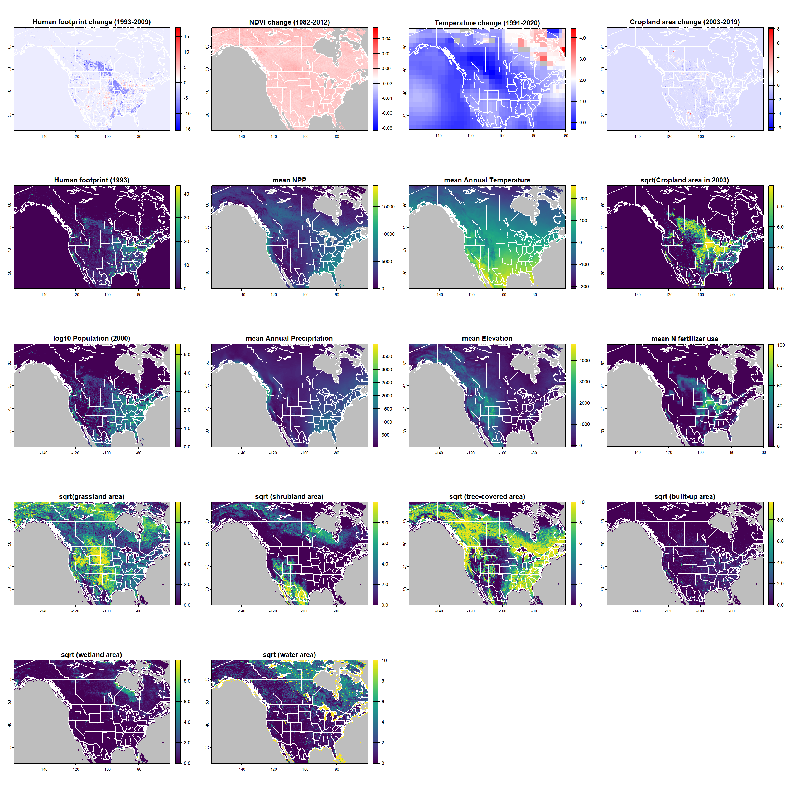
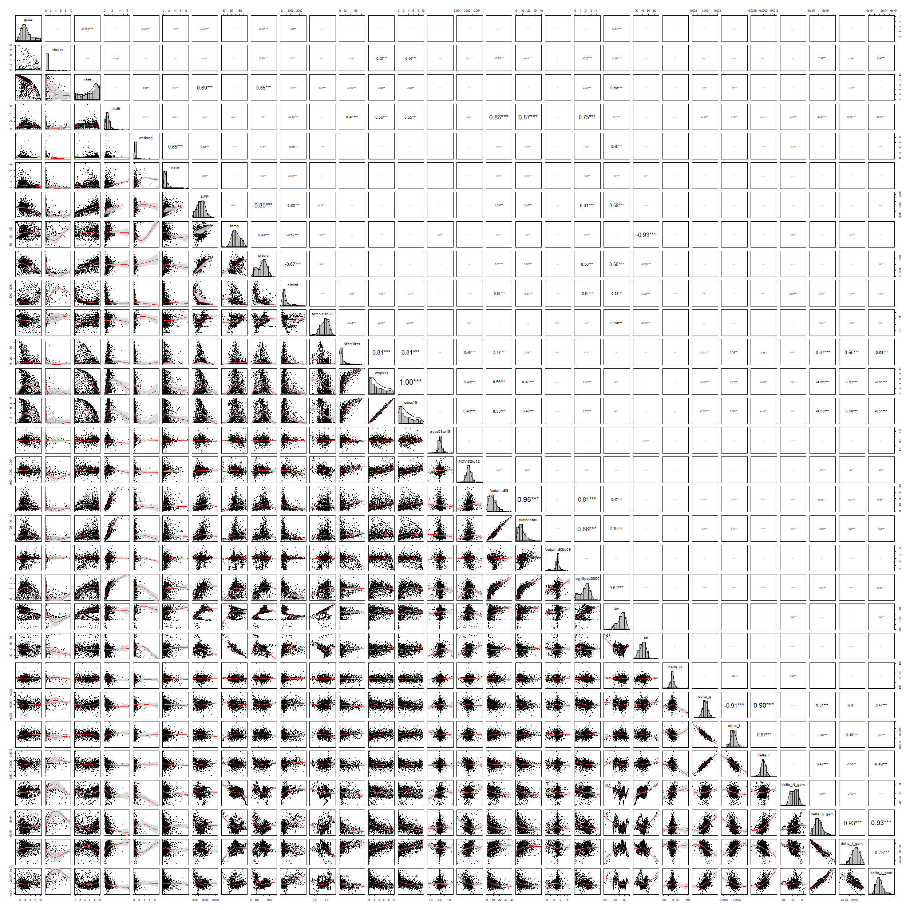
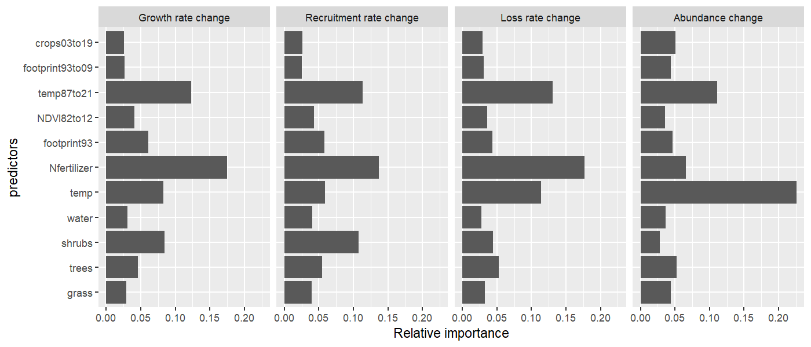

```{r setup, include=FALSE}
knitr::opts_chunk$set(echo = TRUE)
```

# Load libraries and data

```{r, warning = FALSE, message = FALSE}
library(sf)
library(terra)
library(mgcv) 
library(geodata) 
library(rnaturalearth)
library(tidyverse)
library(randomForest)
library(psych)
library(forcats)

rm(list = ls()) # clear the environment
```

```{r, warning = FALSE, message = FALSE}
# Load the shapefile with BBS routes
routes <- st_read("../data/routes_shp/routes_selected_lines.shp") %>% arrange(routes)

## get the states polygon
states <-
  ne_states(returnclass = "sf") %>%
  filter(adm0_a3 == "CAN" | adm0_a3 == "USA" | adm0_a3 == "MEX") %>%
  filter(woe_name != "Hawaii") %>%
  st_crop(st_bbox(c(xmin = -165,
                    xmax = -60,
                    ymax = 62,
                    ymin = 16)))

```

# Loading rasters and extracting their values to the routes

## Area of land cover types

```{r}
grass <- sqrt(terra::rast("rasters/grassland.tif"))
routes$grass <- terra::extract(grass, routes, fun = mean)[,2]

shrubs <- sqrt(terra::rast("rasters/shrubs.tif"))
routes$shrubs <- terra::extract(shrubs, routes, fun = mean)[,2]

trees <- sqrt(terra::rast("rasters/trees.tif"))
routes$trees <- terra::extract(trees, routes, fun = mean)[,2]

built <- sqrt(terra::rast("rasters/built.tif"))
routes$built <- terra::extract(built, routes, fun = mean)[,2]

wetland <- sqrt(terra::rast("rasters/wetland.tif"))
routes$wetland <- terra::extract(wetland, routes, fun = mean)[,2]

water <- sqrt(terra::rast("rasters/water.tif"))
routes$water <- terra::extract(water, routes, fun = mean)[,2]
```

## Net primary productivity (NPP) from MODIS

```{r}
NPP <- terra::rast("rasters/NPP.tif")
routes$NPP <- terra::extract(NPP, routes, fun = mean)[,2]
```

## Temperature, precipitation, and elevation from WorldClim

```{r}
temp <- terra::rast("rasters/temp.tif")
routes$temp <- terra::extract(temp, routes, fun = mean)[,2]

precip <- terra::rast("rasters/precip.tif")
routes$precip <- terra::extract(precip, routes, fun = mean)[,2]

elevat <- terra::rast("rasters/elev.tif")
routes$elevat <- terra::extract(elevat, routes, fun = mean)[,2]
```

## Temperature trend (1991-2020)

```{r}
temp91to20 <- terra::rast("rasters/T_trend.tif")
routes$temp91to20 <- terra::extract(temp91to20, routes, fun = mean)[,2]
```

## Nitrogen fertilizer usage 

```{r}
Nfertilizer <- terra::rast("rasters/Nfertilizer.tif")
routes$Nfertilizer <- terra::extract(Nfertilizer, routes, fun = mean)[,2]
```

## Cropland area and its temporal change (2003-2019)

```{r}
crops03 <- sqrt(terra::rast("rasters/crops03.tif"))
crops19 <- sqrt(terra::rast("rasters/crops19.tif"))

routes$crops03 <- terra::extract(crops03, routes, fun = mean)[,2]
routes$crops19 <- terra::extract(crops19, routes, fun = mean)[,2]
routes$crops03to19 <- routes$crops19 - routes$crops03
```

## Normalized Difference Vegetation Index (NDVI) change (1982-2012)

```{r}
NDVI82to12 <- terra::rast("rasters/NDVI82to12.tif")
routes$NDVI82to12 <- terra::extract(NDVI82to12, routes, fun = mean)[,2]
```

## Human footprint and its temporal change (1993-2009)

```{r}
footprint93 <- terra::rast("rasters/footprint93.tif")
footprint09 <- terra::rast("rasters/footprint09.tif")
delta.footprint <- footprint09 - footprint93

# extract the values from the rasters to routes
routes$footprint93 <- terra::extract(footprint93, routes, fun = mean)[,2]
routes$footprint09 <- terra::extract(footprint09, routes, fun = mean)[,2]
routes$footprint93to09 <- terra::extract(delta.footprint, routes, fun = mean)[,2]
```

## Human population density in 2000

```{r}
# load the 2.5 min raster with human population density
pop2000 <- log10(rast("rasters/pop2000.tif") + 1)

# extract the population density values, summing the values of 2.5 min pixels touching a route
routes$log10pop2000 <- terra::extract(pop2000, routes, fun = mean)[,2]
```

# Plot the rasters

```{r}
png("rasters.png", width= 2000, height = 1700, res = 150)

par(mfrow=c(5,4))

plot(footprint09 - footprint93, col=map.pal("differences", 100),
     main = "Human footprint change (1993-2009)",
     background = "grey")
lines(states, col = "white")

plot(NDVI82to12, col=map.pal("differences", 100),
     main = "NDVI change (1982-2012)",
     background = "grey")
lines(states, col = "white")

plot(temp91to20, col=map.pal("differences", 100),
     main = "Temperature change (1991-2020)",
     background = "grey")
lines(states, col = "white")

plot(crops19 - crops03, col=map.pal("differences", 100),
     main = "Cropland area change (2003-2019)",
     background = "grey")
lines(states, col = "white")

# ---------

plot(footprint93, col=map.pal("viridis", 100),
     main = "Human footprint (1993)",
     background = "grey")
lines(states, col = "white")

plot(NPP, col=map.pal("viridis", 100),
     main = "mean NPP",
     background = "grey")
lines(states, col = "white")

plot(temp, col=map.pal("viridis", 100),
     main = "mean Annual Temperature",
     background = "grey")
lines(states, col = "white")

plot(crops03, col=map.pal("viridis", 100),
     main = "sqrt(Cropland area in 2003)",
     background = "grey")
lines(states, col = "white")

# -----------

plot(pop2000, col=map.pal("viridis", 100),
     main = "log10 Population (2000)",
     background = "grey")
lines(states, col = "white")

plot(precip, col=map.pal("viridis", 100),
     main = "mean Annual Precipitation",
     background = "grey")
lines(states, col = "white")

plot(elevat, col=map.pal("viridis", 100),
     main = "mean Elevation",
     background = "grey")
lines(states, col = "white")

plot(Nfertilizer, col=map.pal("viridis", 100),
     main = "mean N fertilizer use",
     background = "grey")
lines(states, col = "white")

# -----------

plot(grass, col=map.pal("viridis", 100),
     main = "sqrt(grassland area)",
     background = "grey")
lines(states, col = "white")

plot(shrubs, col=map.pal("viridis", 100),
     main = "sqrt (shrubland area)",
     background = "grey")
lines(states, col = "white")

plot(trees, col=map.pal("viridis", 100),
     main = "sqrt (tree-covered area)",
     background = "grey")
lines(states, col = "white")

plot(built, col=map.pal("viridis", 100),
     main = "sqrt (built-up area)",
     background = "grey")
lines(states, col = "white")

plot(wetland, col=map.pal("viridis", 100),
     main = "sqrt (wetland area)",
     background = "grey")
lines(states, col = "white")

plot(water, col=map.pal("viridis", 100),
     main = "sqrt (water area)",
     background = "grey")
lines(states, col = "white")

dev.off()
```



# Load the estimated demographic rates

```{r}
# Load the models' output
for(file in list.files("../mixed_model/outputs/", full.names = T)){
  assign(gsub("^../mixed_model/outputs/|\\.rds$","",file),
         readRDS(file = file))
}

# THE GAM MODEL 
# extract latitude and longitude of route centroids
coords <- data.frame(st_centroid(routes) %>% st_coordinates() )
names(coords) <- c("lon","lat")
routes <- cbind(routes, coords)

## Add raw (not smoothed) values the dataset
routes$delta_N <- overall_N_output$mean$beta1
routes$delta_g <- overall_g_output$mean$beta1
routes$delta_l <- overall_l_output$mean$beta1
routes$delta_r <- overall_r_output$mean$beta1

# fit the gam models
routes$delta_N_gam <- gam(delta_N ~ s(lon, lat, bs = "gp", k = 100, m = 2),
                          data = routes)$fitted.values
routes$delta_g_gam <- gam(delta_g ~ s(lon, lat, bs = "gp", k = 100, m = 2),
                          data = routes)$fitted.values
routes$delta_l_gam <- gam(delta_l ~ s(lon, lat, bs = "gp", k = 100, m = 2),
                          data = routes)$fitted.values
routes$delta_r_gam <- gam(delta_r ~ s(lon, lat, bs = "gp", k = 100, m = 2),
                          data = routes)$fitted.values

# prepare data.frame for analyses
data.frame(names(routes))
dat <- as.data.frame(routes[, 24:ncol(routes)])
dat <- select(dat, -c("geometry")) # remove the last "geometry" column


```

# Exploring patterns and correlations

## Pairwise Spearman correlations

```{r}
png("all_pairs.png", width= 2500, height = 2500)

psych::pairs.panels(dat,
                    ellipses = FALSE,
                    density = TRUE,
                    smooth = TRUE,
                    ci = TRUE,
                    stars = TRUE,
                    scale = TRUE,
                    hist.col = "grey",
                    method = "spearman") # note the Spearman coefficient!

dev.off()
```



# Random Forest analysis

## Set predictors

```{r}
# set all the predictors here which will be used in all the rf models
rf.predictors <- c("grass",
                   "trees",
                   "shrubs",
                   "water",
                   "temp",
                   "Nfertilizer",
                   "footprint93",
                   "NDVI82to12",
                   "temp91to20",
                   "footprint93to09",
                   "crops03to19")
```

## Growth rate change (delta g)

```{r}
rf.g <-randomForest(formula(paste("delta_g_gam ~ ", 
                                  paste(rf.predictors, collapse=" + "))),
                    data = na.omit(dat)) # NOTE THE NA OMIT!!

rf.g.rsq <- rf.g$rsq[length(rf.g$rsq)] # explained variation
rf.g
```

## Abundance change (delta N)

```{r}
rf.N <-randomForest(formula(paste("delta_N_gam ~ ", 
                                  paste(rf.predictors, collapse=" + "))),
                    data = na.omit(dat)) # NOTE THE NA OMIT!!
rf.N.rsq <- rf.N$rsq[length(rf.N$rsq)] # explained variation
rf.N
```

## Recruitment change (delta r)

```{r}
rf.r <-randomForest(formula(paste("delta_r_gam ~ ", 
                                  paste(rf.predictors, collapse=" + "))),
                    data = na.omit(dat)) # NOTE THE NA OMIT!!
rf.r.rsq <- rf.r$rsq[length(rf.r$rsq)] # explained variation
rf.r
```

## Loss change (delta l)

```{r}
rf.l <-randomForest(formula(paste("delta_l_gam ~ ", 
                                  paste(rf.predictors, collapse=" + "))),
                    data = na.omit(dat))
rf.l.rsq <- rf.l$rsq[length(rf.l$rsq)] # explained variation
rf.l
```

## Export variable importances

```{r}
predictors <- forcats::fct_inorder(rep(row.names(importance(rf.g)), times = 4))

importances <- c(rf.g.rsq*importance(rf.g)/sum(importance(rf.g)),
                 rf.g.rsq*importance(rf.r)/sum(importance(rf.r)),
                 rf.g.rsq*importance(rf.l)/sum(importance(rf.l)),
                 rf.g.rsq*importance(rf.N)/sum(importance(rf.N)))

response <- forcats::fct_inorder(rep(c("Growth rate change",
                                       "Recruitment rate change",
                                       "Loss rate change",
                                       "Abundance change"),
                each = length(importance(rf.g))))

res.rf <- data.frame(predictors, importances, response)
```

## Plot variable importances

```{r}
png("rf_importances.png", 
    width=1400, height=600, res = 150)

ggplot(dat = res.rf, aes(x = importances, y = predictors)) +
  geom_col() +
  facet_grid(.~response) +
  xlab("Relative importance")

dev.off()
```


# Session info

```{r}
sessionInfo()
```


